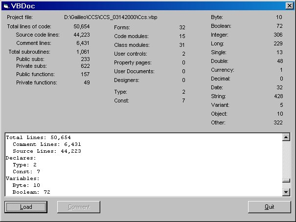



## VBDoc \- Group/Project Analyzer/Documentor

### Description

VBDoc is a project/group analyzer that counts not only the lines of code, but also the number of instances of each data type, function, and subroutine. Outputs to the form for quick analysis and also outputs to HTML. Successfully handles huge projects of unlimited size due to the file parsing capabilities built in. Demonstrates string tokenizing, file i/o, text searching, HTML output. Function-level documenting feature disabled--work in progress.
 
### More Info
 

             |
---                |---
**Submitted On**   |2000-03-31 16:11:18
**By**             |[Jonathan S\. Harbour](https://github.com/Planet-Source-Code/PSCIndex/blob/master/ByAuthor/jonathan-s-harbour.md)
**Level**          |Advanced
**User Rating**    |5.0 (20 globes from 4 users)
**Compatibility**  |VB 5\.0, VB 6\.0
**Category**       |[Complete Applications](https://github.com/Planet-Source-Code/PSCIndex/blob/master/ByCategory/complete-applications__1-27.md)
**World**          |[Visual Basic](https://github.com/Planet-Source-Code/PSCIndex/blob/master/ByWorld/visual-basic.md)
**Archive File**   |[CODE\_UPLOAD44403312000\.zip](https://github.com/Planet-Source-Code/jonathan-s-harbour-vbdoc-group-project-analyzer-documentor__1-6922/archive/master.zip)

